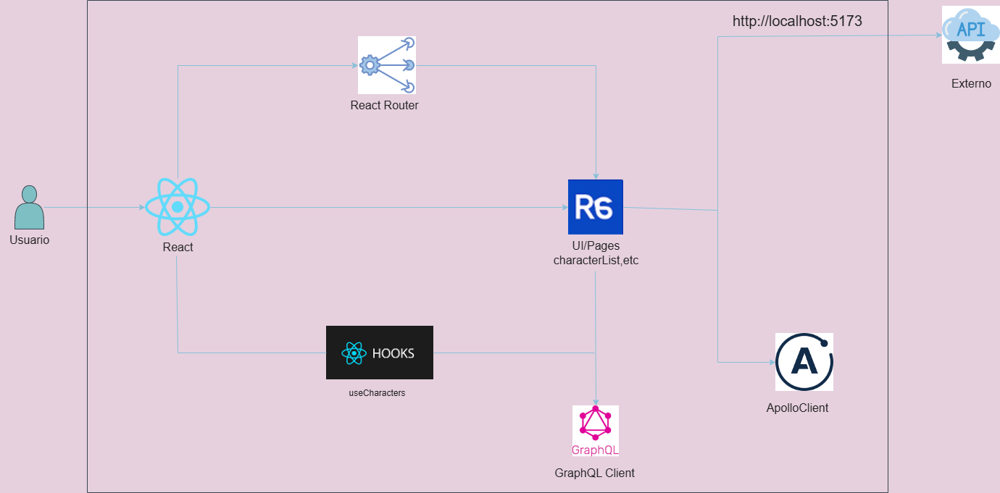

#  Rick and Morty 

Una aplicación web construida con React + TypeScript que consume la API de Rick and Morty (GraphQL), permitiendo explorar, buscar, filtrar, ordenar, marcar como favoritos, eliminar y restaurar personajes de manera interactiva.

---

##  Funcionalidades clave

###  Lista de personajes
- Vista en forma de tarjetas con imagen, nombre y especie.
- Navegación a detalles individuales de cada personaje.
- Diseño responsive y optimizado para móvil.

###  Filtros y búsqueda
- Filtro por tipo de personaje:
  - Favoritos
  - Eliminados (soft delete)
  - Todos
  -  Otros
- Filtro por especie (`Human`, `Alien`, etc).
- Barra de búsqueda por nombre en tiempo real.
- Ordenamiento ascendente o descendente por nombre.

###  Favoritos
- Puedes marcar personajes como favoritos.
- En el listado "Todos", los favoritos aparecen primero.
- Sección separada en el listado para "Favorite Characters" y "All Characters".

###  Soft Delete
- Elimina y recupera personajes con un solo clic.
- Se conserva su estado en `localStorage`.
- Al eliminar/restaurar, se muestra un mensaje de confirmación con `react-toastify`.

###  Soporte móvil
- Barra lateral (sidebar) adaptable con botón tipo hamburguesa.
- Sidebar se oculta al seleccionar un personaje en pantallas pequeñas.
- Botón para mostrar/ocultar sidebar nuevamente.

---

##  Pruebas unitarias

La aplicación incluye **pruebas unitarias** para componentes clave usando:

- [`Jest`](https://jestjs.io/)
- [`React Testing Library`](https://testing-library.com/docs/react-testing-library/intro/)

### Ejecutar pruebas

```bash
npm run test
```

### Estructura de la pruebas

```
src/
├── __tests__/
    ___components__/
│   ├── CharacterList.test.tsx
│   ├── CharacterDetail.test.ts
│   └── CharacterCard.test.tsx
```

---

##  Tecnologías utilizadas

- **React 18 + TypeScript**
- **React Router DOM**
- **Tailwind CSS**
- **Apollo Client** (API GraphQL de Rick and Morty)
- **React Icons** para íconos visuales
- **React Toastify** para notificaciones
- **Jest + Testing Library** para pruebas

---

##  Estructura del proyecto

```
src/
├── components/
│   ├── CharacterList.tsx
│   ├── CharacterCard.tsx
│   └── CharacterDetail.tsx
├── pages/
│   └── CharacterDetailPage.tsx
├── hooks/
│   └── useCharacters.ts
├── types.ts
├── App.tsx
└── __tests__/___components___/
    └───CharacterList.test.tsx
│   ├── CharacterDetail.test.ts
│   └── CharacterCard.test.tsx
```

---

##  Instalación y ejecución local

```bash
# Clona el repositorio
git clone https://github.com/DelahozLuz/RickyandMorty.git

# Entra al proyecto
cd RickyandMorty

# Instala dependencias
npm install

# Corre el proyecto en modo desarrollo
npm run dev
```

---

##  Instalación y ejecución con Docker
```bash
# Clona el repositorio
git https://github.com/DelahozLuz/RickyandMorty.git

# Entra al proyecto
cd RickyandMorty

# Se construye el contenedor
docker build -t app-rick-morty .

# Se ejecuta el contenedor creado
docker run -p 3000:80 RickyandMorty
```


---

##  Scripts útiles

```bash
npm run dev        # Ejecutar en modo desarrollo
npm run build      # Generar build de producción
npm run test           # Ejecutar pruebas unitarias
```

---

##  Diagrama arquitectura



S

